# Table helper

`com.codeborne.selenide.table` adds the three things plain Selenide locators don't give for tables:

1. **column by displayed header text** instead of hard-coded indexes;
2. **row lookup scoped to one column** — `findBy(text("Austria"))` matches any cell of a row;
3. **header ambiguity detection** — `texts().indexOf(header)` silently takes the first of duplicate headers.

Everything it returns is an ordinary lazy `SelenideElement` / `ElementsCollection`, so waiting, conditions, actions and
error messages stay native Selenide.

The screenshots below are taken by real Selenide runs against the test fixtures
(`src/test/resources/table_helper.html`). The highlighted elements are exactly what each call returned:
**blue** — row, **red** — cell(s), **amber** — resolved header.

## Installation

The table helper is an optional module (since 7.19.0). Add a dependency next to Selenide, using the same `<version>` as Selenide:

**Gradle**
```groovy
testImplementation("com.codeborne:selenide-table:<version>")
```

**Maven**
```xml
<dependency>
  <groupId>com.codeborne</groupId>
  <artifactId>selenide-table</artifactId>
  <version>${selenide.version}</version>
  <scope>test</scope>
</dependency>
```

Classes are in package `com.codeborne.selenide.table` (`import com.codeborne.selenide.table.Table;`).

## API

| Type | Methods |
| --- | --- |
| `Table` | `of(SelenideElement root, TableLayout layout)`, `root()`, `headers()`, `rows()`, `row(int index)`, `row(String column, String value)`, `rows(String column, String value)`, `row(SelenideElement row)`, `column(String header)` |
| `TableRow` | `self()`, `cells()`, `cell(int index)`, `cell(String header)` |
| `TableLayout` | `html()`, `aria()`, `of(By rows, By cells, By headers)` — rows relative to the root, cells relative to a row, headers relative to the root |
| `HorizontalTable` | `of(SelenideElement root)`, `headers()`, `value(String header)` |
| `TableColumnException` | thrown when a header is missing (`cell(header)`, `column(header)`) or duplicated |

## 1. Row by a value in one column, then a cell by header

```java
Table customers = Table.of($("#customers"), TableLayout.html());
customers.row("Company", "Ernst Handel").cell("Country").shouldHave(exactText("Austria"));
```

The Ernst Handel row is added 1.5 s after page load — the lookup waits for it like any Selenide element.

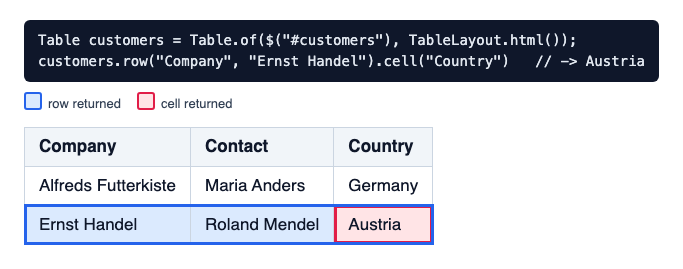

## 2. Why not `findBy(text(...))`

`row("Company", X)` compares only the Company column. `findBy(text(X))` takes the first row that contains X in any cell.

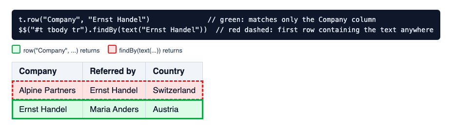

## 3. A whole column, all matching rows

```java
customers.column("Company").shouldHave(exactTexts("Alfreds Futterkiste", "Ernst Handel"));
Table.of($("#query-classic"), TableLayout.html()).rows("Country", "Austria").shouldHave(size(2));
```

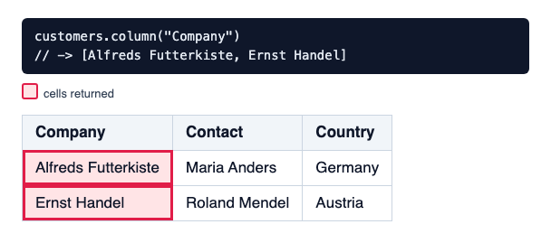

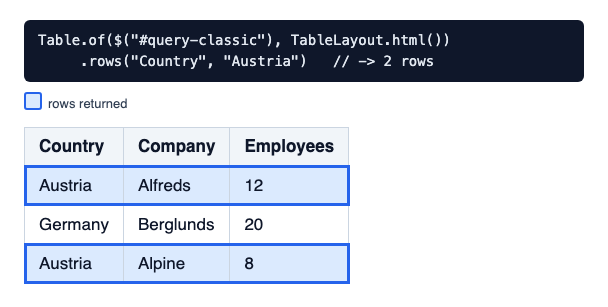

## 4. Grouped headers and filter rows

`html()` reads headers from the last `<thead>` row that contains a `<th>` (cells may be `th` or `td`). A group row with
`colspan` above it and a filter-input row below it don't shift columns.

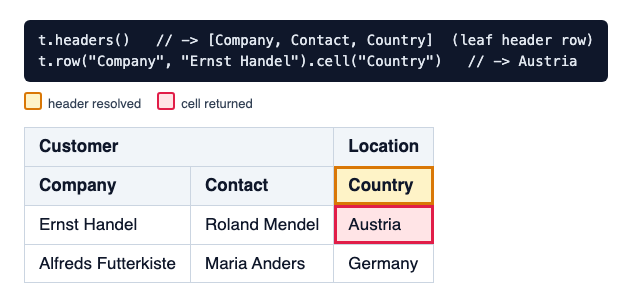

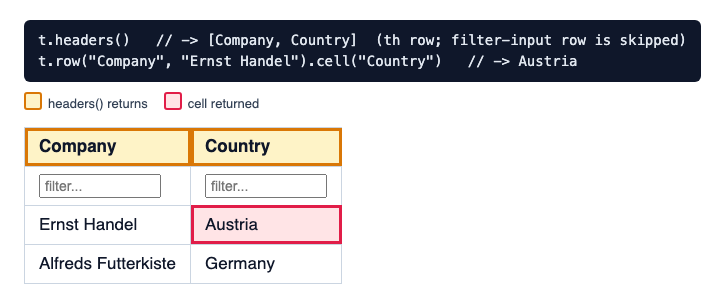

## 5. Nested tables are ignored

`html()` uses direct-child steps (`./tbody/tr`, `./td`), so rows of a table nested in a cell are not counted.

```java
Table.of($("#nested-classic"), TableLayout.html()).rows().shouldHave(size(1));
```

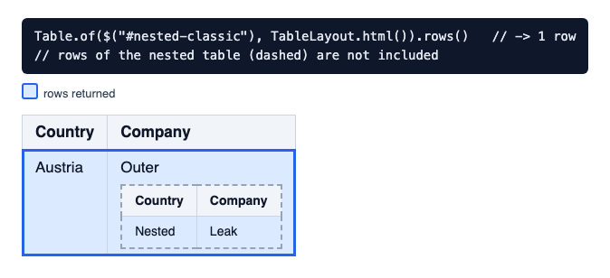

## 6. Not a `<table>`: div grids and ARIA grids

```java
Table grid = Table.of($("#custom-grid"), TableLayout.of(
  By.cssSelector(":scope > .data-row"),
  By.cssSelector(":scope > .cell"),
  By.cssSelector(":scope > .header-row > .cell")));
grid.row("Country", "Austria").cell("Company");

Table.of($("#aria-grid"), TableLayout.aria()).row("Country", "Austria").cell("Company").shouldHave(exactText("Alfreds"));
```

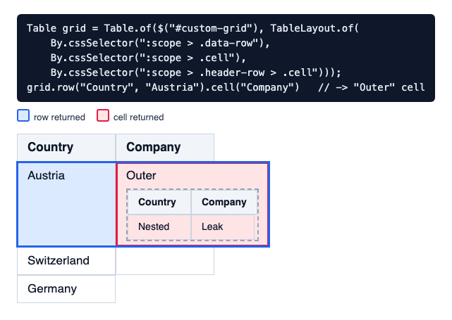

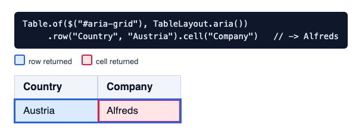

## 7. Any custom match, then cells by header

For matching beyond equal text (regex, several columns, input values), find the row yourself and wrap it:

```java
customers.row(customers.column("Company").findBy(matchText("Ernst.*")).closest("tr"))
  .cell("Country").shouldHave(exactText("Austria"));
```

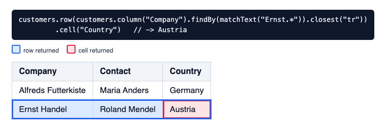

## 8. Key/value tables

`HorizontalTable` reads tables with a label (`<th>`) and a value (`<td>`) in each row. Only the table's own rows are
read, so labels of a nested table are ignored.

```java
HorizontalTable.of($("#horizontal-customers")).value("Telephone 2").shouldHave(exactText("555 77 855"));
```

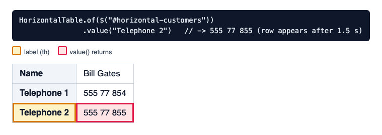

## 9. Headers that render late

`row(column, value)` and `rows(column, value)` re-resolve the column on every evaluation: while the header is not
displayed yet, the lookup keeps retrying. Left: the column is still labelled "Staff"; right: renamed to "Employees",
the row and cell resolve.

```java
t.row("Employees", "20").cell("Company").shouldHave(exactText("Berglunds"), Duration.ofSeconds(4));
```

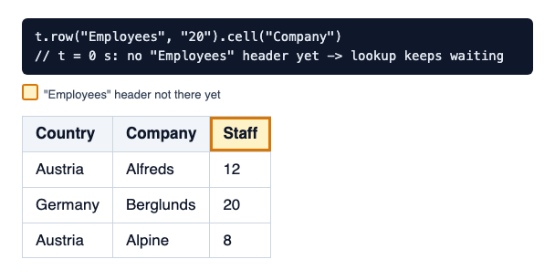 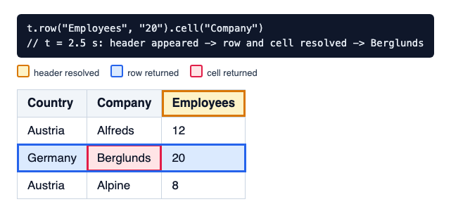

`cell(header)` and `column(header)` resolve the column index once, when called — call them again after columns are
reordered.

## 10. Errors

```
cell("Region")             → TableColumnException: Column "Region" not found in {#query-classic}; displayed headers: [Country, Company, Employees]
row("Company", "x")        → TableColumnException: Column "Company" ambiguous in {#repeated-table}; displayed headers: [Country, Company, Company]
row("Company", "Missing")  → ElementNotFound: Element not found {#customers/By.xpath: ./tbody/tr[td].findBy(Company = "Missing Company")}
```

A column that never appears in a `row(column, value)` lookup fails with `ElementNotFound` after the timeout; a duplicate
header fails immediately.

## Matching rules and limitations

- Headers and values match exactly after whitespace normalization (runs of whitespace and NBSP collapse to one space,
  then trim), like `exactText`.
- Values are compared by visible text: a cell holding an `<input>` or `<select>` reads as empty — use
  `row(SelenideElement)` (section 7).
- Header text includes icons and badges inside the header cell (e.g. a sort arrow) — use a custom headers locator that
  selects the label element.
- `row(column, value)` returns the first match; check uniqueness with `rows(column, value).shouldHave(size(1))`.
- Hidden rows count in indexes, like any `ElementsCollection`.
- `colspan` / `rowspan` in the table body are not supported; grouped headers work only when the last header row lists
  every leaf column (leaf headers spanning rows with `rowspan` need `TableLayout.of(...)`).
- `column(header)` needs XPath row and single-step cell locators (`html()`, `aria()`); with CSS `of(...)` layouts use
  `rows()` and `TableRow.cell(...)`.
- `aria()` matches explicit `role` attributes and also matches nested ARIA grids.
